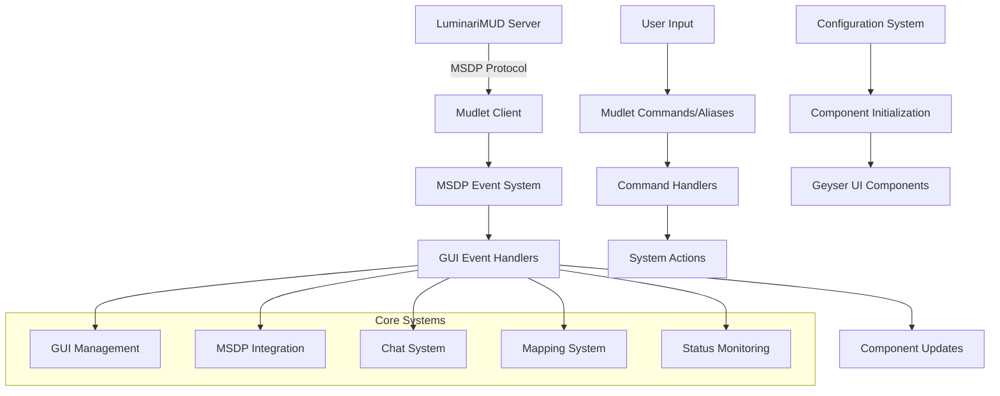
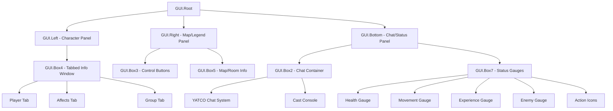
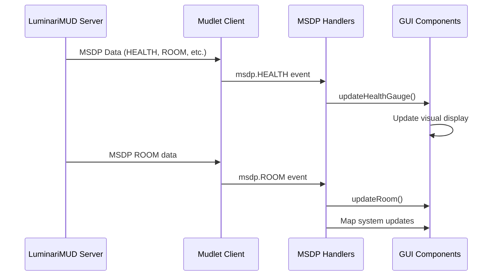
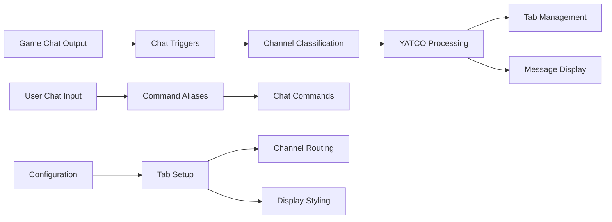
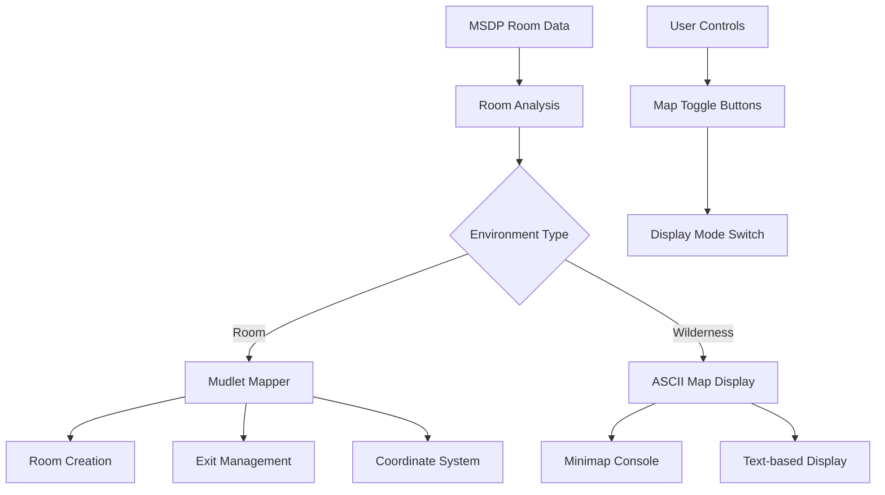
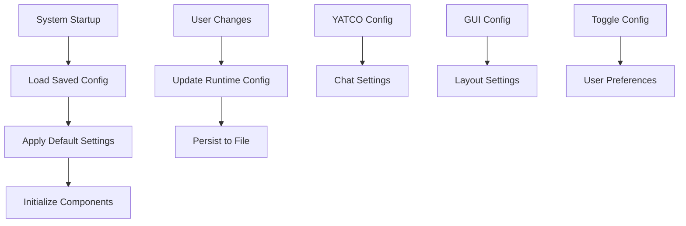
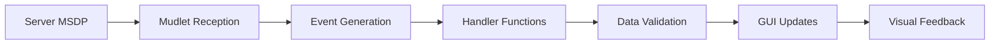
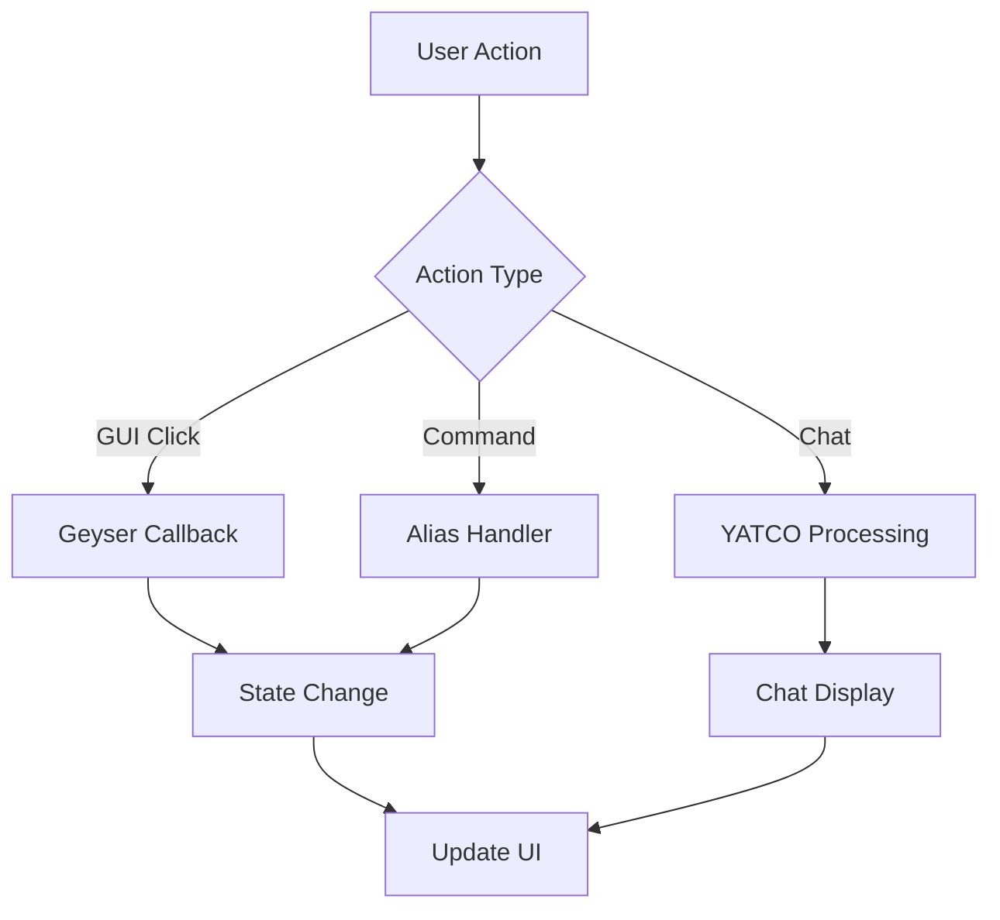

# LuminariGUI Architecture

This document provides a comprehensive overview of the LuminariGUI system architecture, component relationships, and design patterns for developers working on or extending the system.

## High-Level Architecture

LuminariGUI follows an event-driven architecture pattern built on top of Mudlet's event system and the Geyser UI framework. The system is designed as a collection of loosely coupled modules that communicate through events and shared data structures.



## System Components

### 1. Core GUI Framework

The GUI system is built around the [`GUI`](LuminariGUI.xml:1100) namespace and uses the Geyser framework for component management.

#### Component Hierarchy



#### Key Components

- **Background System** ([`GUI.init_background()`](LuminariGUI.xml:1170)): Creates the base layout structure
- **Box System** ([`GUI.init_boxes()`](LuminariGUI.xml:1207)): Manages the main content areas
- **Gauge System** ([`GUI.init_gauges()`](LuminariGUI.xml:1297)): Health, movement, and experience displays
- **Tabbed Interface** ([`GUI.tabbedInfoWindow`](LuminariGUI.xml:1572)): Player, affects, and group information

### 2. MSDP Integration Layer

The MSDP (Mud Server Data Protocol) integration provides real-time game state synchronization.



#### MSDP Event Handlers

The system registers handlers for key MSDP variables:

```lua
-- Core character data
registerAnonymousEventHandler("msdp.HEALTH", "GUI.updateHealthGauge")
registerAnonymousEventHandler("msdp.MOVEMENT", "GUI.updateMovesGauge")
registerAnonymousEventHandler("msdp.EXPERIENCE", "GUI.updateExperienceGauge")

-- Combat and actions
registerAnonymousEventHandler("msdp.ACTIONS", "GUI.updateActionIcons")
registerAnonymousEventHandler("msdp.OPPONENT_HEALTH", "GUI.updateEnemyGauge")

-- Environment and social
registerAnonymousEventHandler("msdp.ROOM", "GUI.updateRoom")
registerAnonymousEventHandler("msdp.GROUP", "GUI.updateGroup")
registerAnonymousEventHandler("msdp.AFFECTS", "GUI.updateAffectIcons")
```

### 3. Chat System (YATCO Integration)

The chat system integrates Demonnic's YATCO (Yet Another Tabbed Chat Option) with LuminariGUI's styling and layout.



#### Chat Architecture

- **Channel Management**: Automatic routing of different chat types (tell, chat, group, etc.)
- **Tab System**: Dynamic tab creation and management
- **Styling Integration**: Consistent theming with main GUI
- **Notification System**: Tab blinking and alert mechanisms

### 4. Mapping System

The mapping system provides dual-mode display capabilities with automatic room detection and creation.



#### Mapping Components

- **Room Detection** ([`map.eventHandler()`](LuminariGUI.xml:984)): Processes MSDP room data
- **Automatic Mapping** ([`make_room()`](LuminariGUI.xml:650)): Creates rooms and exits
- **Coordinate Management**: Handles room positioning and map stretching
- **Terrain System**: Color-coded terrain types with visual representation

### 5. Configuration Management

The configuration system manages persistent settings and runtime configuration.



## Data Flow Patterns

### 1. MSDP Data Processing



### 2. User Interaction Flow



## Design Patterns

### 1. Event-Driven Architecture

The system uses Mudlet's event system for loose coupling between components:

```lua
-- Publisher
raiseEvent("customEvent", data)

-- Subscriber  
registerAnonymousEventHandler("customEvent", "handlerFunction")
```

### 2. Component Pattern

GUI components follow a consistent initialization and update pattern:

```lua
function GUI.init_componentName()
    -- Create Geyser components
    -- Set styling
    -- Configure event handlers
end

function GUI.update_componentName()
    -- Process data
    -- Update visual display
    -- Handle state changes
end
```

### 3. Configuration Pattern

Settings are managed through structured configuration objects:

```lua
-- Central configuration
GUI.config = {
    setting1 = value1,
    setting2 = value2
}

-- Module-specific configuration
demonnic.chat.config = {
    channels = {...},
    styling = {...}
}
```

## Extension Points

### 1. Adding New GUI Components

To add new GUI components:

1. Create initialization function following the `GUI.init_*` pattern
2. Add to main `GUI.init()` function
3. Register appropriate event handlers
4. Implement update functions for data changes

### 2. Custom MSDP Handlers

New MSDP variables can be handled by:

1. Requesting the variable in [`GUI.onProtocolEnabled()`](LuminariGUI.xml:2430)
2. Creating handler function following `GUI.update*` pattern
3. Registering event handler for `msdp.VARIABLE_NAME`

### 3. Chat System Extensions

YATCO can be extended by:

1. Adding new channels to `demonnic.chat.config.channels`
2. Creating triggers to route messages to new channels
3. Implementing custom channel processing logic

## Error Handling

### Current Patterns

The system uses basic error handling patterns:

- Function existence checks: `if GUI.Affects.init then GUI.Affects.init() end`
- Conditional updates: `if msdp.VARIABLE then updateFunction() end`
- Default value handling: `local value = msdp.VARIABLE or "Unknown"`

### Recommended Improvements

For robust error handling:

1. Implement centralized error logging
2. Add validation for MSDP data integrity
3. Provide graceful degradation for missing components
4. Add recovery mechanisms for failed connections

## Performance Considerations

### Current Optimizations

- Event-driven updates minimize unnecessary processing
- Geyser framework provides efficient UI rendering
- Conditional component updates based on data availability

### Optimization Opportunities

1. **Event Throttling**: Limit high-frequency updates (like health changes)
2. **Component Lazy Loading**: Initialize components only when needed
3. **Memory Management**: Clean up unused timers and event handlers
4. **Data Caching**: Cache expensive calculations or repeated operations

## Testing Architecture

### Current Testing

The system relies on manual testing with LuminariMUD server integration.

### Recommended Testing Strategy

1. **Unit Tests**: Test individual component functions
2. **Integration Tests**: Test MSDP data flow and event handling
3. **UI Tests**: Automated testing of GUI component behavior
4. **Mock Server**: Test with simulated MSDP data

## Security Considerations

### Input Validation

- MSDP data should be validated before processing
- User input through chat and commands should be sanitized
- File system operations should be restricted to safe directories

### Resource Protection

- Limit timer frequency to prevent resource exhaustion
- Implement bounds checking for array/table operations
- Monitor memory usage for long-running sessions