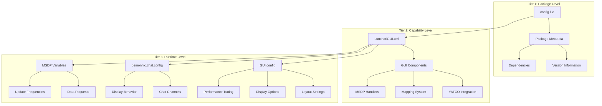

# LuminariGUI Configuration Guide

This document provides configuration options for LuminariGUI, from the minimal default setup to advanced customization scenarios.

## Table of Contents

- [Configuration Overview](#configuration-overview)
- [Current State: Basic Package Configuration](#current-state-basic-package-configuration)
- [Enhanced Configuration via Python Toolchain](#enhanced-configuration-via-python-toolchain)
- [Configuration Architecture](#configuration-architecture)
- [Quick Start Guide](#quick-start-guide)
- [Progressive Enhancement Pathway](#progressive-enhancement-pathway)
- [GUI Runtime Configuration](#gui-runtime-configuration)
- [Chat System Configuration](#chat-system-configuration)
- [Display Settings](#display-settings)
- [MSDP Configuration](#msdp-configuration)
- [Performance Settings](#performance-settings)
- [Advanced Customization](#advanced-customization)
- [Development Workflow](#development-workflow)
- [Troubleshooting](#troubleshooting)

## Configuration Overview

LuminariGUI uses a multi-layered configuration system that supports both minimal setup and comprehensive customization:

### Configuration Layers

1. **Package Configuration** - Basic metadata in [`config.lua`](config.lua)
2. **XML-Based Capabilities** - Core functionality defined in [`LuminariGUI.xml`](LuminariGUI.xml)
3. **Python Toolchain Enhancement** - Metadata enrichment via [`create_package.py`](PYTHON_TOOLS.md)
4. **Runtime Configuration** - Dynamic GUI, chat, and MSDP settings

### Current Reality vs Documentation

**Current State:**
- Minimal [`config.lua`](config.lua) with only: `mpackage = "LuminariGUI"`
- Rich functionality available through XML structure
- Enhanced configuration possible via Python toolchain

**Previous Documentation Assumed:**
- Extensive pre-configured [`GUI.config`](CONFIGURATION.md:41) structures
- Complex chat system configurations
- Built-in MSDP configuration systems

This guide bridges that gap by showing you how to progress from minimal to advanced configuration.

## Current State: Basic Package Configuration

### The Minimal config.lua

Currently, [`config.lua`](config.lua) contains only:

```lua
mpackage = "LuminariGUI"
```

This minimal configuration is sufficient for basic operation because:

1. **XML Structure Provides Defaults**: The [`LuminariGUI.xml`](LuminariGUI.xml) file (4,205 lines) defines:
   - YATCO chat system integration
   - Mapping system capabilities
   - GUI layout components
   - Toggle systems for user preferences
   - MSDP integration points

2. **Runtime Configuration**: Most customization happens through runtime variables and functions

3. **No Complex Setup Required**: The package works immediately with MUD clients

### What You Get Out of the Box

With the minimal configuration, you automatically have:

- **GUI Layout**: Default panel arrangements and sizing
- **Chat Integration**: YATCO-based chat system with standard channels
- **Mapping System**: Terrain display and coordinate systems
- **Status Displays**: Health, movement, and experience gauges
- **MSDP Support**: Basic protocol integration for real-time data

## Enhanced Configuration via Python Toolchain

### The create_package.py Enhancement

The Python toolchain provides configuration enhancement through [`create_package.py`](PYTHON_TOOLS.md). This tool can generate enriched metadata:

```python
def create_config_lua(package_name, author_name, version="1.0.0"):
    """Generate enhanced config.lua with metadata"""
    return f"""
mpackage = "{package_name}"
mauthor = "{author_name}"
mtitle = "{package_name}"
mdescription = "Enhanced LuminariGUI package"
mversion = "{version}"
micon = ""
mdate = "{datetime.now().strftime('%Y-%m-%d')}"
mdependencies = {{}}
"""
```

### Enhanced config.lua Example

After Python toolchain enhancement:

```lua
mpackage = "LuminariGUI"
mauthor = "YourName"
mtitle = "LuminariGUI"
mdescription = "Enhanced LuminariGUI package with rich metadata"
mversion = "1.0.0"
micon = ""
mdate = "2024-01-15"
mdependencies = {}
```

### Benefits of Enhancement

1. **Package Management**: Proper versioning and dependency tracking
2. **Development Workflow**: Integration with build and deployment systems
3. **Metadata Rich**: Author, description, and date information
4. **Future Compatibility**: Prepared for advanced package management features

## Configuration Architecture

### Three-Tier Configuration System



### Configuration Flow

1. **Package Bootstrap**: [`config.lua`](config.lua) provides package identity
2. **XML Processing**: [`LuminariGUI.xml`](LuminariGUI.xml) defines capabilities and defaults
3. **Runtime Initialization**: Dynamic configuration objects are created
4. **User Customization**: Runtime settings can be modified

## Quick Start Guide

### For Immediate Use (Current State)

1. **Install the Package**: The minimal [`config.lua`](config.lua) is sufficient
2. **Load in MUD Client**: Import the package
3. **Default Operation**: Everything works with XML-defined defaults

### For Enhanced Metadata

1. **Use Python Toolchain**: Run [`create_package.py`](PYTHON_TOOLS.md)
2. **Enhanced config.lua**: Get rich metadata
3. **Better Integration**: Improved development workflow

### For Advanced Customization

1. **Study XML Structure**: Understand [`LuminariGUI.xml`](LuminariGUI.xml) capabilities
2. **Runtime Configuration**: Modify [`GUI.config`](CONFIGURATION.md:41) and related objects
3. **Custom Extensions**: Add your own configuration layers

## Progressive Enhancement Pathway

### Level 1: Basic Package (Current State)

**What You Have:**
- Minimal [`config.lua`](config.lua) with package name
- Full GUI functionality via XML defaults
- Standard MUD client integration

**What You Can Do:**
- Use the system immediately
- Rely on sensible defaults
- Basic runtime customization

### Level 2: Enhanced Metadata (Python Toolchain)

**Enhancement Steps:**
1. Install Python toolchain (see [`PYTHON_TOOLS.md`](PYTHON_TOOLS.md))
2. Run `create_package.py` for your package
3. Get enhanced [`config.lua`](config.lua) with metadata

**Benefits:**
- Proper versioning and author information
- Better package management
- Integration with development tools
- Future-proofed configuration

### Level 3: Full Customization (Advanced)

**Advanced Configuration:**
- Custom GUI layouts and themes
- Advanced chat system configuration
- Performance optimization
- Plugin development
- Custom MSDP variable handling

**Prerequisites:**
- Understanding of Lua programming
- Familiarity with Mudlet architecture
- Knowledge of XML structure

## GUI Runtime Configuration

### Default Configuration Structure

Once the package is loaded, you can access and modify:

```lua
-- This structure is created at runtime from XML definitions
GUI.config = {
    layout = {
        leftPanelWidth = 300,
        rightPanelWidth = 250, 
        bottomPanelHeight = 200,
        gaugePanelHeight = 40
    },
    display = {
        showMap = true,
        showChat = true,
        showStatusGauges = true,
        showControlButtons = true,
        showTabbedInfo = true
    },
    styling = {
        theme = "default",
        transparency = 180,
        fontSize = 12,
        fontFamily = "Arial"
    }
}
```

### Panel Dimension Customization

```lua
-- Adjust layout after GUI is loaded
GUI.config.layout.leftPanelWidth = 350  -- Character info area
GUI.config.layout.rightPanelWidth = 280  -- Map/controls area
GUI.config.layout.bottomPanelHeight = 250  -- Chat/status area
GUI.config.layout.gaugePanelHeight = 50  -- Status gauges

-- Apply changes
GUI.refresh()
```

### Component Positioning

```lua
-- Fine-tune component positions
GUI.config.positions = {
    healthGauge = {x = 5, y = 5, width = 120, height = 25},
    movesGauge = {x = 130, y = 5, width = 120, height = 25},
    experienceGauge = {x = 255, y = 5, width = 150, height = 25},
    
    controlButtons = {
        map = {x = 5, y = 5, width = 60, height = 25},
        chat = {x = 70, y = 5, width = 60, height = 25},
        help = {x = 135, y = 5, width = 60, height = 25}
    }
}
```

## Chat System Configuration

### YATCO Integration

The chat system is built on YATCO (Yet Another TabbedChatwindOw) and configured through:

```lua
-- Runtime configuration after YATCO is loaded
demonnic.chat.config = {
    channels = {
        all = {
            color = "white",
            timestamp = true,
            timestampFormat = "[HH:mm:ss] ",
            blink = false
        },
        chat = {
            color = "white",
            timestamp = true,
            blink = true
        },
        tell = {
            color = "cyan",
            timestamp = true,
            blink = true
        }
    },
    
    -- Visual settings
    tabFont = "Arial",
    tabFontSize = 10,
    chatHeight = 150,
    maxScrollback = 1000
}
```

### Adding Custom Channels

```lua
-- Function to add new channels
function addChatChannel(name, config)
    demonnic.chat.config.channels[name] = config
    if demonnic.chat then
        demonnic.chat:addTab(name)
    end
end

-- Add a guild channel
addChatChannel("guild", {
    color = "green",
    timestamp = true,
    blink = true
})
```

## Display Settings

### Theme Configuration

```lua
-- Define custom themes
GUI.themes = {
    default = {
        background = "rgba(0, 0, 0, 180)",
        border = "#666666",
        text = "#FFFFFF",
        accent = "#4A90E2"
    },
    
    dark = {
        background = "rgba(20, 20, 20, 200)",
        border = "#444444",
        text = "#CCCCCC",
        accent = "#6A9BD2"
    }
}

-- Apply theme
function GUI.applyTheme(themeName)
    local theme = GUI.themes[themeName]
    if theme then
        for key, value in pairs(theme) do
            GUI.config.styling[key] = value
        end
        GUI.refresh()
    end
end
```

### Font Configuration

```lua
GUI.config.fonts = {
    default = {family = "Arial", size = 12, weight = "normal"},
    gauges = {family = "Arial", size = 11, weight = "bold"},
    chat = {family = "Consolas", size = 11, weight = "normal"}
}
```

## MSDP Configuration

### Variable Management

```lua
-- Configure MSDP variables to request
GUI.msdpConfig = {
    character = {
        "HEALTH", "MAX_HEALTH",
        "MOVEMENT", "MAX_MOVEMENT", 
        "EXPERIENCE", "EXPERIENCE_TNL",
        "LEVEL", "CLASS", "RACE"
    },
    
    combat = {
        "OPPONENT_HEALTH", "OPPONENT_NAME",
        "COMBAT_STATE"
    },
    
    environment = {
        "ROOM", "ROOM_NAME", "ROOM_EXITS",
        "AREA_NAME"
    }
}

-- Request all configured variables
function GUI.requestMSDPVariables()
    for category, variables in pairs(GUI.msdpConfig) do
        for _, variable in ipairs(variables) do
            sendMSDP("REQUEST", variable)
        end
    end
end
```

### Update Frequencies

```lua
-- Control update frequencies
GUI.msdpFrequencies = {
    fast = {
        variables = {"HEALTH", "MOVEMENT", "OPPONENT_HEALTH"},
        interval = 100  -- milliseconds
    },
    
    medium = {
        variables = {"EXPERIENCE", "AFFECTS"},
        interval = 500
    },
    
    slow = {
        variables = {"ROOM", "AREA_NAME"},
        interval = 2000
    }
}
```

## Performance Settings

### Update Optimization

```lua
GUI.config.performance = {
    -- Update frequencies
    gaugeUpdateFreq = 100,
    mapUpdateFreq = 500,
    chatUpdateFreq = 50,
    
    -- Memory management
    maxChatHistory = 1000,
    maxMapNodes = 5000,
    garbageCollectFreq = 30000,
    
    -- Visual performance
    animateGauges = true,
    animationSpeed = 200,
    reduceTransparency = false
}
```

### Memory Management

```lua
GUI.config.memory = {
    autoCleanup = true,
    cleanupInterval = 60000,
    maxEventHandlers = 100,
    maxTimers = 50,
    maxCacheSize = 5000
}
```

## Advanced Customization

### Custom Component Layouts

```lua
-- Layout profiles for different screen sizes
GUI.layoutProfiles = {
    small = {
        leftPanelWidth = 250,
        rightPanelWidth = 200,
        bottomPanelHeight = 150,
        fontSize = 10,
        compactMode = true
    },
    
    large = {
        leftPanelWidth = 400,
        rightPanelWidth = 300,
        bottomPanelHeight = 250,
        fontSize = 14,
        compactMode = false
    }
}

-- Apply layout profile
function GUI.applyLayoutProfile(profileName)
    local profile = GUI.layoutProfiles[profileName]
    if profile then
        for key, value in pairs(profile) do
            GUI.config.layout[key] = value
        end
        GUI.refresh()
    end
end
```

### Event-Based Customization

```lua
-- Custom event handlers
GUI.customEvents = {
    onHealthCritical = function(health, maxHealth)
        local percentage = (health / maxHealth) * 100
        if percentage <= 10 then
            GUI.flashWarning("CRITICAL HEALTH!", "red")
            send("wimpy 90")
        end
    end,
    
    onLevelUp = function(newLevel)
        GUI.showCelebration("LEVEL UP!", 
            string.format("Welcome to level %d!", newLevel))
    end
}

-- Register events
registerAnonymousEventHandler("msdp.HEALTH", function()
    if msdp.HEALTH and msdp.MAX_HEALTH then
        GUI.customEvents.onHealthCritical(
            tonumber(msdp.HEALTH), 
            tonumber(msdp.MAX_HEALTH)
        )
    end
end)
```

## Development Workflow

### Configuration Enhancement Process

1. **Start with Minimal**: Use default [`config.lua`](config.lua)
2. **Test Basic Functionality**: Verify XML-based defaults work
3. **Enhance with Python**: Use [`create_package.py`](PYTHON_TOOLS.md) for metadata
4. **Customize Runtime**: Modify [`GUI.config`](CONFIGURATION.md:41) as needed
5. **Test and Iterate**: Validate changes and performance

### Integration with Python Toolchain

The Python toolchain (documented in [`PYTHON_TOOLS.md`](PYTHON_TOOLS.md)) provides:

- **Package Creation**: Enhanced [`config.lua`](config.lua) generation
- **Version Management**: Automated versioning and metadata
- **Build Integration**: Seamless development workflow
- **Deployment Support**: Package preparation for distribution

### Configuration Validation

```lua
-- Validate configuration integrity
function GUI.validateConfig()
    local issues = {}
    
    -- Check layout bounds
    if GUI.config.layout.leftPanelWidth < 200 then
        table.insert(issues, "leftPanelWidth too small")
    end
    
    -- Check performance settings
    if GUI.config.performance.gaugeUpdateFreq < 50 then
        table.insert(issues, "gaugeUpdateFreq too frequent")
    end
    
    -- Report issues
    if #issues > 0 then
        print("Configuration issues found:")
        for _, issue in ipairs(issues) do
            print("  - " .. issue)
        end
        return false
    end
    
    return true
end
```

## Troubleshooting

### Common Configuration Issues

#### The Documentation Gap

**Problem**: Documentation assumes extensive built-in configuration that doesn't exist

**Solution**: Understand the three-tier system:
1. Minimal [`config.lua`](config.lua) (current state)
2. XML-based capabilities (always available)
3. Runtime configuration (created dynamically)

#### Missing GUI.config Structure

**Problem**: [`GUI.config`](CONFIGURATION.md:41) doesn't exist initially

**Solution**: 
```lua
-- Configuration is created at runtime
-- Check if GUI is loaded before accessing config
if GUI and GUI.config then
    -- Safe to modify configuration
    GUI.config.layout.leftPanelWidth = 350
else
    print("GUI not yet initialized")
end
```

#### Python Toolchain Integration

**Problem**: Enhanced configuration requires Python toolchain

**Solution**:
1. Install Python toolchain (see [`PYTHON_TOOLS.md`](PYTHON_TOOLS.md))
2. Run `create_package.py` for enhanced metadata
3. Understand that basic functionality works without enhancement

### Performance Troubleshooting

```lua
-- Performance monitoring
function GUI.checkPerformance()
    print("Performance Check:")
    
    -- Memory usage
    local memBefore = collectgarbage("count")
    collectgarbage()
    local memAfter = collectgarbage("count")
    print(string.format("Memory: %.2f KB (freed %.2f KB)", 
                       memAfter, memBefore - memAfter))
    
    -- Active components
    local timerCount = 0
    if timers then
        for _ in pairs(timers) do timerCount = timerCount + 1 end
    end
    print("Active timers:", timerCount)
    
    -- Recommendations
    if timerCount > 20 then
        print("WARNING: High timer count may affect performance")
    end
end
```

### Reset Functions

```lua
-- Reset to minimal configuration
function GUI.resetToMinimal()
    GUI.config = {
        layout = {leftPanelWidth = 300, rightPanelWidth = 250, 
                 bottomPanelHeight = 200, gaugePanelHeight = 40},
        display = {showMap = true, showChat = true, 
                  showStatusGauges = true, showControlButtons = true},
        styling = {theme = "default", transparency = 180, 
                  fontSize = 12, fontFamily = "Arial"}
    }
    GUI.refresh()
    print("Configuration reset to minimal defaults")
end

-- Clean up all resources
function GUI.cleanup()
    if GUI.timers then
        for _, timerID in pairs(GUI.timers) do
            killTimer(timerID)
        end
        GUI.timers = {}
    end
    
    if GUI.eventHandlers then
        for _, handlerID in pairs(GUI.eventHandlers) do
            killAnonymousEventHandler(handlerID)
        end
        GUI.eventHandlers = {}
    end
    
    collectgarbage()
    print("LuminariGUI cleanup complete")
end
```

## Migration from Previous Documentation

### Understanding the Changes

**Previous Assumption**: Complex configuration existed by default
**Current Reality**: Minimal configuration with enhancement pathways

**Migration Strategy**:
1. Start with minimal [`config.lua`](config.lua)
2. Use Python toolchain for metadata enhancement
3. Build runtime configuration progressively
4. Leverage XML-based defaults

### Configuration Examples Context

When you see configuration examples in this document:

- **Runtime Examples**: Apply after GUI initialization
- **Enhancement Examples**: Require Python toolchain
- **XML Examples**: Reference underlying capability structure

## Conclusion

LuminariGUI's configuration system is designed for progressive enhancement:

1. **Start Simple**: Minimal [`config.lua`](config.lua) gets you running
2. **Enhance Gradually**: Python toolchain adds metadata richness
3. **Customize Extensively**: Runtime configuration provides full control
4. **Extend Infinitely**: XML structure supports unlimited customization

This approach ensures that users can start immediately with sensible defaults while providing clear pathways to advanced customization as their needs grow.

For implementation details on the Python toolchain, see [`PYTHON_TOOLS.md`](PYTHON_TOOLS.md).
For XML structure reference, see [`LuminariGUI.xml`](LuminariGUI.xml).

The configuration system bridges the gap between simplicity and power, ensuring that LuminariGUI works well for both beginners and advanced users.