# LuminariGUI Python Development Tools

## Overview

The LuminariGUI project includes a sophisticated Python toolchain that provides comprehensive development workflow automation, XML management, and release orchestration. These tools work together to streamline the development process from code validation to production releases.

### Tool Suite
- **[`validate_package.py`](#validate_packagepy---package-validation)** - Package validation with integrated Lua syntax checking
- **[`format_xml.py`](#format_xmlpy---xml-formatting)** - XML formatting and maintenance  
- **[`create_package.py`](#create_packagepy---release-management)** - Complete release management with optional testing integration
- **[`run_tests.py`](#run_testspy---testing-orchestration)** - Comprehensive testing framework orchestrator
- **Testing Infrastructure** - Complete suite of automated testing tools for code quality assurance

### Key Benefits
- **Integrated Workflow**: Tools work seamlessly together in development and release processes
- **Comprehensive Testing**: Automated testing infrastructure prevents regression and ensures quality
- **Cross-Platform**: Compatible with Windows, macOS, and Linux
- **Git Integration**: Built-in version control workflow automation
- **Quality Assurance**: Comprehensive validation, testing, and error detection
- **Performance Monitoring**: Built-in performance benchmarking and optimization detection

## Installation

### Requirements

#### Core Tools
- **Python 3.6+** (recommended: Python 3.8+)
- **Git** (required for release workflows)
- **Standard Library Only**: No external dependencies required for core tools

#### Testing Infrastructure (Optional)
- **Lua/LuaJIT** (required for comprehensive testing)
- **luac** (optional, for syntax validation - tests skipped if missing)
- **luacheck** (optional, for static analysis - tests skipped if missing)

### Verification
```bash
# Check Python version
python3 --version

# Verify tools are executable
python3 validate_package.py --help
python3 format_xml.py --help  
python3 create_package.py --help

# Quick test (if LuminariGUI.xml exists)
python3 validate_package.py
```

### Cross-Platform Notes
- **Windows**: Use `python` instead of `python3` if Python 3 is your default
- **macOS/Linux**: Use `python3` to ensure Python 3 interpreter
- **All Platforms**: Tools handle file paths and line endings automatically

## Tools Reference

### validate_package.py - Package Validation

**Purpose**: Validates Mudlet packages for XML structure compliance, embedded Lua syntax validation, and comprehensive package integrity checking.

#### Command-Line Usage
```bash
# Validate default file (LuminariGUI.xml) - includes Lua syntax checking
python3 validate_package.py

# Validate specific file with full checking
python3 validate_package.py path/to/file.xml

# Skip Lua syntax checking (XML structure only)
python3 validate_package.py --no-lua-syntax

# Quiet mode (minimal output)
python3 validate_package.py --quiet

# Exit codes: 0 = success, 1 = validation failed
```

#### Features
- **Well-formedness Check**: Ensures XML is properly structured
- **Mudlet Package Validation**: Verifies required elements and attributes
- **Integrated Lua Syntax Validation**: Uses luac to validate all Lua code blocks
- **Component Analysis**: Counts and reports package components
- **Common Issues Detection**: Identifies unescaped characters and potential problems
- **Comprehensive Error Reporting**: Shows both XML structure and Lua syntax errors
- **Integration Ready**: Called automatically by [`create_package.py`](#create_packagepy---release-management)
- **Flexible Options**: Can skip Lua checking for XML-only validation

#### Output Interpretation
```bash
✅ XML validation passed for LuminariGUI.xml     # Success
❌ XML Parse Error: not well-formed             # Critical error
⚠ Warning: No version attribute found          # Warning (non-fatal)
```

#### Example Output
```
Validating LuminariGUI.xml...
✓ MudletPackage version: 1.001

Package Components:
  ✓ TriggerPackage: 1
  ✓ AliasPackage: 1  
  ✓ ScriptPackage: 1
  ✓ ActionPackage: 1

Checking for common issues...
  ✓ No common issues detected

✅ XML validation passed for LuminariGUI.xml
```

### format_xml.py - XML Formatting

**Purpose**: Formats and pretty-prints XML files with proper indentation, consistent structure, and automatic backup creation.

#### Command-Line Usage
```bash
# Format in-place with backup
python3 format_xml.py

# Format specific file
python3 format_xml.py path/to/file.xml

# Format to new file
python3 format_xml.py -o formatted_output.xml

# Format without backup
python3 format_xml.py --no-backup
```

#### Features
- **Pretty Printing**: Consistent indentation and structure
- **Automatic Backup**: Creates `.backup` file when formatting in-place
- **Verification**: Validates formatted XML for integrity
- **Size Reporting**: Shows file size changes after formatting
- **XML Declaration**: Ensures proper XML and DOCTYPE declarations

#### Example Output
```
Formatting LuminariGUI.xml...
Created backup: LuminariGUI.xml.backup
Verifying formatted XML...
✅ Successfully formatted LuminariGUI.xml

File size:
  Original: 234,567 bytes
  Formatted: 256,789 bytes
  Difference: +22,222 bytes (+9.5%)
```

### create_package.py - Release Management

**Purpose**: Complete release management system with Git integration, version management, package creation, and workflow automation.

#### Core Command-Line Options

**Basic Package Creation:**
```bash
# Create release package with auto-version
python3 create_package.py

# Create development package with timestamp
python3 create_package.py --dev

# Create with specific version
python3 create_package.py --version 2.1.0

# Use custom XML source
python3 create_package.py --xml CustomGUI.xml
```

**Release Workflow:**
```bash
# Complete release workflow
python3 create_package.py --release

# Dry-run (test without changes)
python3 create_package.py --release --dry-run

# Release with remote push
python3 create_package.py --release --push
```

**Git Integration:**
```bash
# Individual git operations
python3 create_package.py --git-branch    # Create release branch
python3 create_package.py --git-commit    # Commit version updates
python3 create_package.py --git-tag       # Create release tag
python3 create_package.py --push          # Push to remote

# Force overwrite existing tag
python3 create_package.py --git-tag --force-tag
```

**Maintenance Operations:**
```bash
# List all packages with metadata
python3 create_package.py --list

# Generate missing metadata files
python3 create_package.py --migrate-metadata

# Clean up legacy files
python3 create_package.py --cleanup-legacy
```

**Advanced Options:**
```bash
# Skip validations (use with caution)
python3 create_package.py --skip-validation
python3 create_package.py --skip-git-check

# Verbose output
python3 create_package.py --verbose
```

#### Release Workflow Deep-Dive

The `--release` option executes a complete release workflow:

1. **Pre-release Validation**
   - Package validation using [`validate_package.py`](#validate_packagepy---package-validation)
   - Git repository status check
   - Version consistency verification

2. **Version Management**
   - Updates XML header version
   - Updates CHANGELOG.md with release date
   - Ensures version consistency across files

3. **Git Workflow**
   - Creates release branch (`release/v{version}`)
   - Commits version updates
   - Creates annotated release tag

4. **Package Creation**
   - Generates versioned `.mpackage` file
   - Creates metadata JSON file
   - Includes all required assets

5. **Optional Remote Push**
   - Pushes release branch and tags
   - Requires `--push` flag for safety

#### Package Structure

**Release Packages:**
```
Releases/
├── LuminariGUI-v2.1.0.mpackage           # Release package
├── LuminariGUI-v2.1.0.json               # Release metadata
```

**Development Packages:**
```
Releases/
├── LuminariGUI-v2.1.1-dev-20240115-143022.mpackage  # Dev package
├── LuminariGUI-v2.1.1-dev-20240115-143022.json      # Dev metadata
```

#### Git Integration Features

- **Branch Management**: Automatic release branch creation
- **Version Tagging**: Annotated tags with release information
- **Commit Automation**: Standardized commit messages
- **Remote Synchronization**: Push branches and tags to origin
- **Safety Checks**: Git status validation before operations

## Development Workflow

### Daily Development Workflow

```mermaid
flowchart LR
    A[📝 Edit XML] --> B[🔍 Validate]
    B --> C{Valid?}
    C -->|No| D[🐛 Fix Issues]
    D --> B
    C -->|Yes| E[🎨 Format]
    E --> F[📦 Dev Package]
    F --> G[🧪 Test in Mudlet]
    G --> H{Ready?}
    H -->|No| A
    H -->|Yes| I[🚀 Release]
```



**Commands:**
```bash
# Step 1: Validate changes
python3 validate_package.py

# Step 2: Format XML (optional)
python3 format_xml.py

# Step 3: Create development package
python3 create_package.py --dev

# Step 4: Test in Mudlet, then either continue development or release
```

### Release Workflow

```mermaid
flowchart TD
    A[🚀 Release Command] --> B[📋 Pre-release Validation]
    B --> C[🔍 XML Validation]
    C --> D[📊 Git Status Check]
    D --> E[📝 Version Management]
    E --> F[🌿 Git Workflow]
    F --> G[📦 Package Creation]
    G --> H[🏷️ Git Tagging]
    H --> I[📤 Push to Remote]
    I --> J[✅ Release Complete]
```



**Complete Release Process:**
```bash
# Option 1: Full automated release
python3 create_package.py --release --push

# Option 2: Step-by-step release
python3 create_package.py --release --dry-run    # Test first
python3 create_package.py --release              # Execute
python3 create_package.py --push                 # Push when ready
```

### Maintenance Workflow

```mermaid
flowchart LR
    A[🔍 List Packages] --> B[📋 Review Metadata]
    B --> C[🧹 Cleanup Legacy]
    C --> D[🔄 Migrate Metadata]
    D --> E[✅ Organized Releases]
```



**Maintenance Commands:**
```bash
# Review existing packages
python3 create_package.py --list

# Clean up old development packages (keeps latest 3)
python3 create_package.py --cleanup-legacy

# Generate missing metadata for old packages
python3 create_package.py --migrate-metadata
```

## Integration Examples

### Pre-Commit Validation
```bash
#!/bin/bash
# Pre-commit hook example
echo "Validating LuminariGUI.xml..."
python3 validate_package.py || exit 1

echo "Formatting XML..."
python3 format_xml.py --no-backup

echo "Creating development package..."
python3 create_package.py --dev --skip-git-check
```

### Continuous Integration
```yaml
# CI workflow example
name: Validate and Package
on: [push, pull_request]

jobs:
  validate:
    runs-on: ubuntu-latest
    steps:
      - uses: actions/checkout@v3
      - name: Validate XML
        run: python3 validate_package.py
      - name: Create package
        run: python3 create_package.py --dev
```

### Release Automation
```bash
#!/bin/bash
# Release script example
set -e

echo "🚀 Starting automated release..."

# Validate everything first
python3 validate_package.py || exit 1

# Test release workflow
python3 create_package.py --release --dry-run || exit 1

# Execute release
python3 create_package.py --release --push

echo "✅ Release completed successfully!"
```

## Troubleshooting

### Common Issues

#### XML Validation Failures
```bash
❌ XML Parse Error: not well-formed (invalid token): line 123, column 45
```
**Solution**: Check for unescaped characters (`<`, `>`, `&`) in script content. Use CDATA sections for complex scripts.

#### Git Integration Problems
```bash
❌ Error: Git repository has uncommitted changes
```
**Solutions**:
- Commit changes: `git add . && git commit -m "Update"`
- Skip check: `python3 create_package.py --skip-git-check`
- Stash changes: `git stash`

#### Version Inconsistencies
```bash
⚠️ Version inconsistency detected
   Requested version: 2.1.0
   CHANGELOG.md version: 2.0.0
```
**Solution**: Update CHANGELOG.md or use `--release` workflow for automatic version management.

#### Package Creation Failures
```bash
❌ Error: LuminariGUI.xml not found
```
**Solutions**:
- Check file exists: `ls -la LuminariGUI.xml`
- Specify path: `python3 create_package.py --xml path/to/file.xml`
- Verify working directory

### Platform-Specific Notes

#### Windows
```powershell
# Use python instead of python3 if Python 3 is default
python create_package.py --release

# Git bash recommended for full git integration
```

#### macOS
```bash
# Ensure Python 3 is used
python3 create_package.py --release

# May need to install git if using minimal macOS
xcode-select --install
```

#### Linux
```bash
# Standard usage
python3 create_package.py --release

# May need python3-dev for some distributions
sudo apt-get install python3-dev  # Ubuntu/Debian
```

## run_tests.py - Testing Orchestration

**Purpose**: Orchestrates comprehensive testing infrastructure to ensure code quality, prevent regressions, and catch issues before they cause system instability.

### Command-Line Usage
```bash
# Run complete test suite
python3 run_tests.py

# Run specific test type
python3 run_tests.py --test syntax      # Lua syntax validation
python3 run_tests.py --test quality     # Static code analysis  
python3 run_tests.py --test functions   # Unit tests
python3 run_tests.py --test events      # Event system testing
python3 run_tests.py --test system      # Memory leak detection
python3 run_tests.py --test performance # Performance benchmarks

# Control execution
python3 run_tests.py --parallel         # Run tests in parallel
python3 run_tests.py --sequential       # Run tests sequentially
python3 run_tests.py --skip-optional    # Skip tests with missing dependencies

# Generate reports
python3 run_tests.py --report results.json --format json
python3 run_tests.py --report results.txt --format text
```

### Testing Infrastructure Components

#### Individual Test Tools
- **`test_lua_syntax.py`** - Validates Lua syntax using luac compiler
- **`test_lua_quality.py`** - Static code analysis using luacheck with comprehensive rules
- **`test_functions.py`** - Unit tests for core functions with mock data
- **`test_events.py`** - Event system testing with MSDP mocks and cascade testing
- **`test_system.py`** - Memory leak detection and error boundary validation
- **`test_performance.py`** - Performance benchmarks with threshold monitoring

#### Test Data & Configuration
- **`tests/mock_data/`** - Mock MSDP data for testing (room, affects, group data)
- **`tests/sample_scripts/`** - Sample Lua scripts for validation
- **`tests/test_configs/`** - Test configuration files and settings
- **`tests/expected_outputs/`** - Expected test results for validation

### Integration with Development Workflow

#### Pre-commit Testing
```bash
# Validate before committing
python3 validate_package.py && python3 run_tests.py
```

#### Release Testing
```bash
# Create package with comprehensive testing
python3 create_package.py --run-tests

# Full release workflow with testing
python3 create_package.py --release --run-tests
```

#### Continuous Integration Ready
- Exit codes for automated workflows
- JSON report format for CI/CD integration
- Parallel execution for faster feedback
- Dependency detection with graceful degradation

### Error Code Reference

#### validate_package.py
- **0**: Validation successful (XML structure and Lua syntax)
- **1**: XML parse error, Lua syntax error, or validation failure

#### format_xml.py  
- **0**: Formatting successful
- **1**: Parse error or formatting failure

#### create_package.py
- **0**: Operation successful
- **1**: Validation failure, test failure, git error, or package creation failure

#### run_tests.py
- **0**: All tests passed
- **1**: One or more tests failed

#### Individual Test Tools
- **test_lua_syntax.py**: 0 = syntax valid, 1 = syntax errors found
- **test_lua_quality.py**: 0 = quality passed, 1 = issues found  
- **test_functions.py**: 0 = all tests passed, 1 = test failures
- **test_events.py**: 0 = event tests passed, 1 = event test failures
- **test_system.py**: 0 = system tests passed, 1 = system issues found
- **test_performance.py**: 0 = benchmarks passed, 1 = performance issues

### Debug Mode

Enable verbose output for detailed troubleshooting:
```bash
python3 create_package.py --verbose --release --dry-run
```

This shows:
- Detailed file operations
- Git command execution
- Version detection process
- Package creation steps

## Advanced Usage

### Custom Workflows

**Hotfix Release:**
```bash
# Quick hotfix without full validation
python3 create_package.py --version 2.0.1 --skip-validation --git-tag --push
```

**Development Branch Package:**
```bash
# Create package from feature branch
git checkout feature/new-ui
python3 create_package.py --dev --skip-git-check
```

**Metadata Recovery:**
```bash
# Regenerate all metadata files
python3 create_package.py --migrate-metadata
python3 create_package.py --list  # Verify results
```

### Integration with Other Tools

**With Mudlet Package Manager:**
```bash
# Create package and install directly
python3 create_package.py --dev
# Copy to Mudlet profile directory
cp Releases/LuminariGUI-v*.mpackage ~/.config/mudlet/profiles/Main/
```

**With Version Control:**
```bash
# Tag-based releases
git tag v2.1.0
python3 create_package.py --version 2.1.0 --git-commit
```

## Best Practices

### Development
1. **Always validate before committing**: `python3 validate_package.py`
2. **Use development packages for testing**: `python3 create_package.py --dev`
3. **Format XML regularly**: `python3 format_xml.py`
4. **Test release workflow**: `python3 create_package.py --release --dry-run`

### Release Management
1. **Use the integrated release workflow**: `python3 create_package.py --release`
2. **Test before pushing**: Omit `--push` flag initially
3. **Maintain clean git history**: Commit changes before releasing
4. **Document releases**: Update CHANGELOG.md before releasing

### Maintenance
1. **Regular cleanup**: `python3 create_package.py --cleanup-legacy`
2. **Monitor package sizes**: Review output of `--list` command
3. **Backup important releases**: Keep copies of major version packages
4. **Update metadata**: Run `--migrate-metadata` after tool updates

## Related Documentation

- **[PACKAGING.md](PACKAGING.md)**: Package creation and distribution strategies
- **[QUICK_REFERENCE.md](QUICK_REFERENCE.md)**: Quick command reference
- **[DEPLOYMENT.md](DEPLOYMENT.md)**: Installation and setup procedures
- **[CONTRIBUTING.md](CONTRIBUTING.md)**: Development guidelines and workflow
- **[TROUBLESHOOTING.md](TROUBLESHOOTING.md)**: General troubleshooting guide

## Tool Integration Matrix

| Tool | validate_package.py | format_xml.py | create_package.py |
|------|---------------------|---------------|-------------------|
| **validate_package.py** | - | Called before formatting | Integrated validation |
| **format_xml.py** | Calls validation | - | Used in development |
| **create_package.py** | Always calls | Optional integration | - |

This comprehensive toolchain provides everything needed for professional LuminariGUI development and release management.